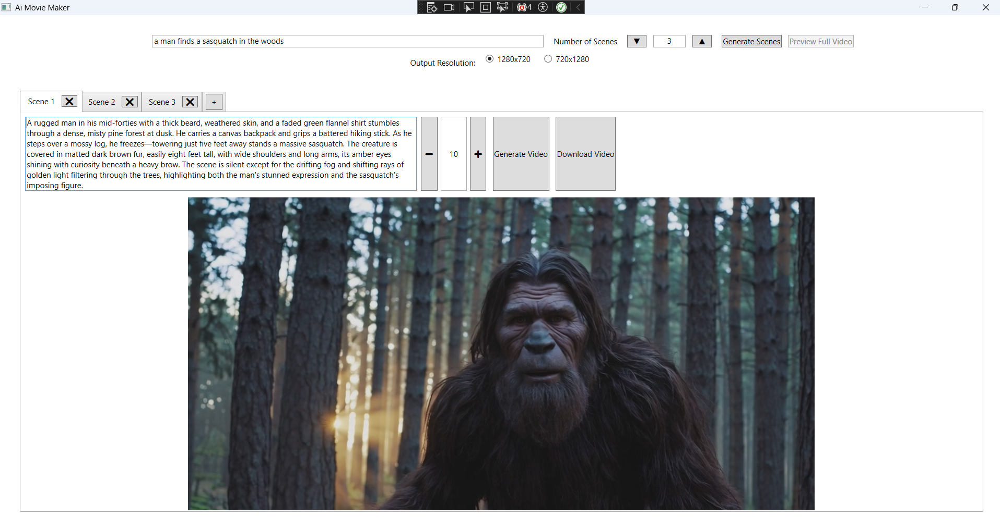
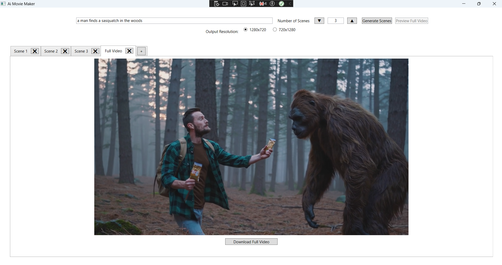
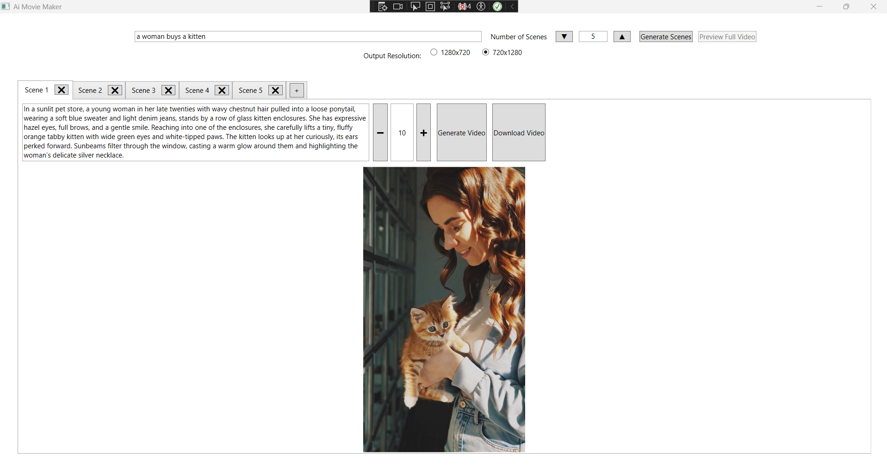
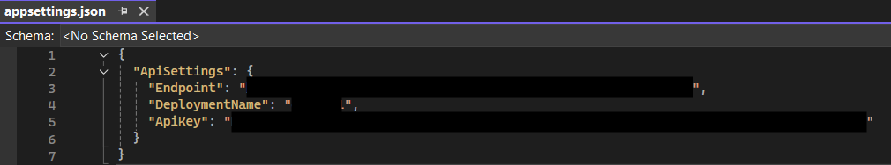

# AI Movie Maker #
----------

**How to Run**
Add appsettings.json to project directory, include the endpoint, deplpoyment name and ApiKey. Ensure in the appsettings.json File Properties, Copy to Output Directory is set to Copy Always. 

